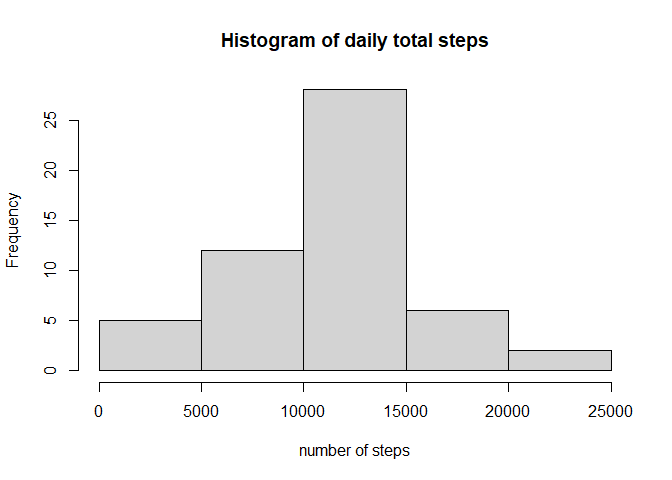
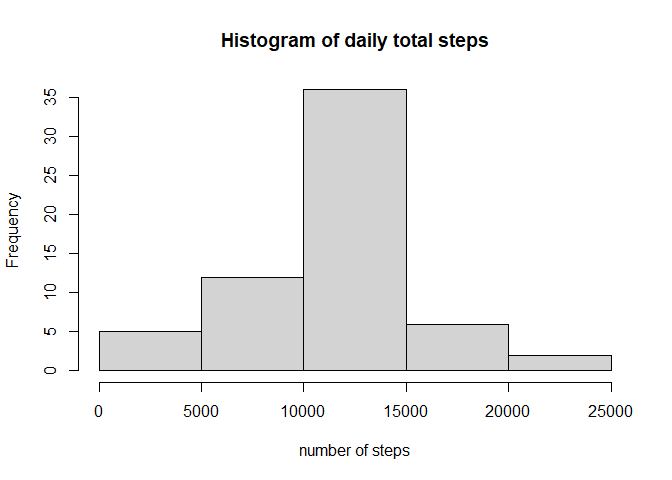
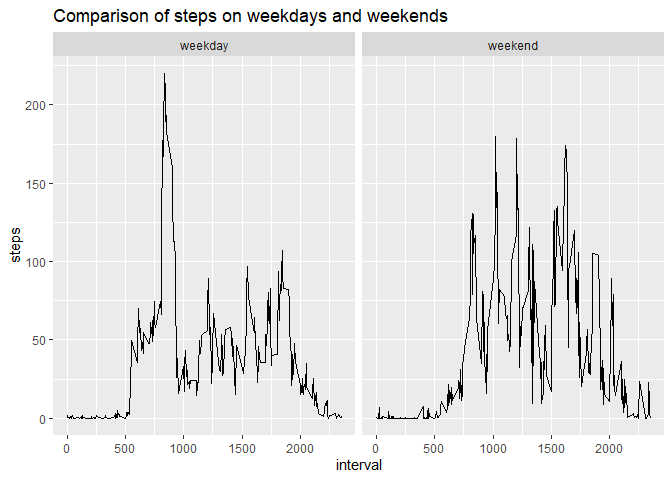

1-Reading and Loading the Data
------------------------------

The first step is to load the .csv file. (It is assumed that the
directory is set properly)

    library(knitr)
    opts_chunk$set(echo = TRUE)
    library(lubridate)

    ## 
    ## Attaching package: 'lubridate'

    ## The following objects are masked from 'package:base':
    ## 
    ##     date, intersect, setdiff, union

    library(dplyr)

    ## 
    ## Attaching package: 'dplyr'

    ## The following objects are masked from 'package:stats':
    ## 
    ##     filter, lag

    ## The following objects are masked from 'package:base':
    ## 
    ##     intersect, setdiff, setequal, union

    library(ggplot2)
    activity <- read.csv("activity.csv")
    activity$date <- ymd(activity$date)

What is mean total number of steps taken per day?
-------------------------------------------------

1.Calculate the total number of steps taken per day

    activity_nona <- filter(activity, !is.na(activity$steps))
    grp <- group_by(activity_nona, date)
    numsteps <- summarize(grp, steps = sum(steps))

    ## `summarise()` ungrouping output (override with `.groups` argument)

    head(numsteps)

    ## # A tibble: 6 x 2
    ##   date       steps
    ##   <date>     <int>
    ## 1 2012-10-02   126
    ## 2 2012-10-03 11352
    ## 3 2012-10-04 12116
    ## 4 2012-10-05 13294
    ## 5 2012-10-06 15420
    ## 6 2012-10-07 11015

    ##find total number of steps per day
    daily_total <- aggregate(steps~date, activity, sum)

    ##plot histogram of total steps per day
    hist(daily_total$steps, main = "Histogram of daily total steps", xlab = "number of steps")

 2.Calculate
and report the mean and median of the total number of steps taken per
day

    meansteps <- mean(numsteps$steps)
    mediansteps <- median(numsteps$steps)
    ##plot histogram of total steps per day

The results are:

    meansteps

    ## [1] 10766.19

    mediansteps

    ## [1] 10765

What is the average daily activity pattern?
-------------------------------------------

    ##find average for each five minute interval
    interval_average <- aggregate(steps~interval, activity, mean)

    ##plot five minute interval average
    plot(interval_average$interval, interval_average$steps, type = "l", main = "Five minute interval average steps", xlab = "Interval (minutes)", ylab = "Average number of steps per five minute interval")

    ##find five minute interval with max number of steps
    interval_average$steps[which.max(interval_average$steps)]

    ## [1] 206.1698

Imputing missing values
-----------------------

    ##count number of NAs in the steps column
    sum(is.na(activity$steps))

    ## [1] 2304

    ##replace missing values with the mean for that five minute interval and make a new activity data set (activity.complete)
    activity.complete <- activity
    i <- 0
    j <- 0

    for(i in 1:length(activity.complete$steps)) {
      j <- activity.complete$interval[i]
      if(activity.complete$steps[i] %in% NA) {
        activity.complete$steps[i] <-          
          interval_average$steps[interval_average$interval == j] 
      }
      i <- i + 1
    }

    ##find total number of steps per day
    daily_total.complete <- aggregate(steps~date, activity.complete, sum)

    ##plot histogram of total steps per day
    hist(daily_total.complete$steps, main = "Histogram of daily total steps", xlab = "number of steps")

\#\# Are there differences in activity patterns between weekdays and
weekends?

    ##convert dates to days of the week
    days <- weekdays(activity.complete$date)

    ##create two-level factor variable patterns with levels of weekend and weekday
    patterns <- matrix(1:length(days))
    i <- 1
    for(i in 1:length(days)) {
      if(days[i] == "Saturday") {
        patterns[i] <- "weekend"
      }
      if(days[i] == "Sunday") {
        patterns[i] <- "weekend"
      }
      else { 
        patterns[i] <- "weekday"
      }
      i <- i + 1
    }

    ##add patterns factor to dataset
    activity.complete <- cbind(activity.complete,patterns)

    ##find average steps by interval across weekdays and weekends
    pattern_average <- aggregate(steps~interval + patterns, activity.complete, mean)

    ##plot steps by weekend or weekday
    library(ggplot2)
    qplot(interval, steps, data=pattern_average, facets = .~patterns,  geom = "line", main = "Comparison of steps on weekdays and weekends")

